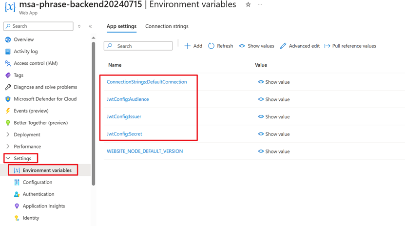
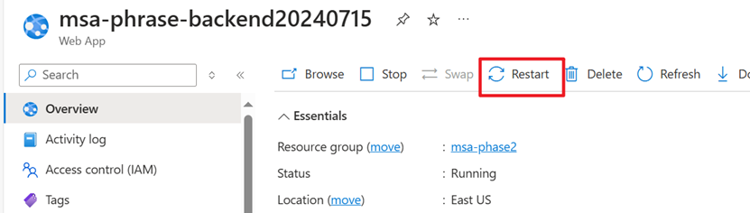
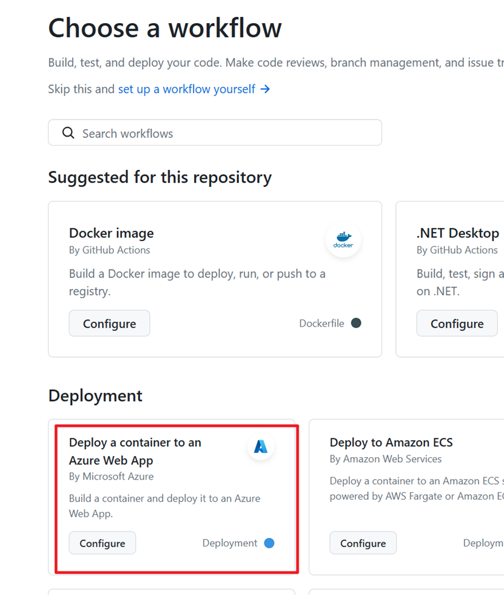

# 1. Browse online

Both the front-end and back-end of this project have been deployed on Azure. The back-end has been deployed in two versions: a traditional direct deployment and a containerized deployment.

Frontend: https://delightful-pebble-089fd801e.5.azurestaticapps.net/

Backend: https://msa-phrase-backend20240715.azurewebsites.net/

Containerized backend: https://containerized-msaphase2backend.azurewebsites.net/

# 2. Running locally

Prerequisites: nodejs, vs community 2022, SQL Server 2022 Developer, dotnet-ef

1. Download code

   ```
   Git clone https://github.com/victorbqcheng/msa-phase2.git
   ```

2. Initialize database

   ```
   cd backend
   dotnet ef database update
   ```

3. Run backend

   a. Create *Secrets.json* file to configure *OpenAiApiKey*

   

   

   b. Open *backend.sln* with vs2022. Then press Ctrl+F5 or use the menu to start backend.

   

   If it runs successfully, you'll see the following window:

   

4. Run frontend

   ```
   cd frontend
   ```
   
   ```
   npm install
   ```
   
   ```
   npm run dev
   ```
   

   Open the link in your browser:

   

   The home page is shown as below:

   

5. View storybook

   ```
   npm run storybook
   ```

   

# 3. Deployed on Azure

I referred to Azure's documentation and Microsoft training to deploy the entire project. If you wish to deploy this project on Azure, you can follow the outlined process. Since most of the project uses default configurations, the deployment is relatively straightforward.

## 3.1. Deploy database

   Please refer to the following link:

   https://learn.microsoft.com/en-us/training/modules/azure-sql-deploy-configure/3-exercise-deploy-database

   

   Get ConnectionString

   

   Run the following command:

   ```
   dotnet ef database update --connection your_connection_string
   ```

## 3.2. Deploy backend

   There are two methods to deploy the backend: directly to Azure App Service or by containerizing the application and then deploying it to Azure App Service.

   ### 3.2.1. Direct deployment  
   In vs2022, select Build->Publish backend
     
   Follow the prompts step-by-step to complete the deployment. After the deployment is finished, configure the environment variables as indicated below:  
     
   After configuring the environment variables, restart the service:  
     

   ### 3.2.2. Deploy containerized backend
   #### a. Create a docker image registry:  
   [Quickstart - Create registry in portal - Azure Container Registry | Microsoft Learn](https://learn.microsoft.com/en-us/azure/container-registry/container-registry-get-started-portal?tabs=azure-cli)  
   [Exercise - Deploy a Docker image to an Azure Container Instance - Training | Microsoft Learn](https://learn.microsoft.com/en-us/training/modules/intro-to-containers/7-exercise-deploy-docker-image-to-container-instance?source=learn)

   #### b. Add a github workflow to build docker image and push it to ACR:  
   *Web API Development with ASP. NET Core 8 - Chapter 14 - Page 620:621*  
   #### c. Create and Configure Azure Web App   
   [Quickstart: Run a custom container on App Service - Azure App Service | Microsoft Learn](https://learn.microsoft.com/en-us/azure/app-service/quickstart-custom-container?tabs=dotnet&pivots=container-linux-azure-portal)  
     
     

   #### d. Deploy the docker image to Azure App Service.  
   Follow the instructions of this github action:  
   

## 3.3 Deploy Frontend.
   [Exercise - Create an Azure Static Web App - Training | Microsoft Learn](https://learn.microsoft.com/en-us/training/modules/publish-app-service-static-web-app-api/4-exercise-static-web-apps?pivots=react)
